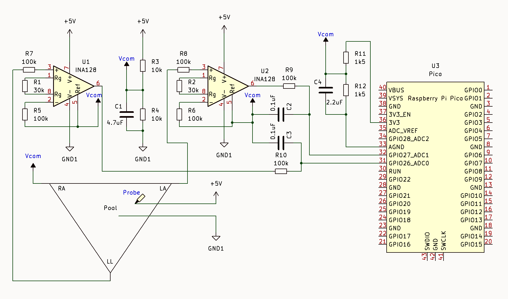

# Vectorial Reconstruction of an Electric Dipole in Saline Solution
This project implements a minimal analog front-end and software reconstruction algorithm to track a dipole vector immersed in saline solution. Drawing from the **Einthoven triangle** and its bipolar leads, maps electric potential to a real-time vectorial representation, similar how ECG devices take cardiac signals.
<p align="center">
  
  
## 1. Motivation and context
The conduction and acquisition of biopotentials are non-observable phenomena, mastering these concepts typically requires a deep dive into abstract physiological theory. This project provides a tangible, real-time bridge between theory and practice.
By measuring potential differences induced by a hand probe within a conductive saline medium, this software calculates and graphically reconstructs a single dipole orientation and magnitude in real time. This approach transforms invisible electrical fields into an intuitive visual format.
## 2. System Overview
The physical setup mimics a standard **three-lead frontal plane EKG configuration** (RA, LA, LL) within a controlled environment.
### 2.1 Physical Configuration
-**The Medium:** A 500mL container filled with a 0.9% saline solution or a salt-water mixture.
-**The Electrodes:** Three terminal electrodes, which can be made from peeled wire, are placed in an equilateral triangle around the perimeter of the container.
**Peripheral Spacing:** Peripheral electrodes are ideally separated by 120 to 150 mm.
### 2.2 The Dipole Source
- **Anode:** A wire is placed at the center of the container with a small exposed portion. This allows the system to show positive and negative voltages at the center of the projection lines.
- **Cathode (Probe):** An oscilloscope probe serves as the hand movable electrode. A wire with a 300Ω series resistor can also be used for testing.
- **Power:** The system is powered with 5V DC relative to the central terminal. This configuration is specifically chosen to minimize cathode corrosion within the electrolytic solution.
### 2.3 Data Acquisition & Processing
While high-performance differential ADCs or microcontrollers like the NXP K64F are recommended for precision, this repository provides a setup for easy testing using a Raspberry Pi Pico. The signal is pre-amplified by instrumentation amplifiers, biased at mid-supply, and processed in software to remove offset and gain before being streamed as comma-separated numeric values for real-time plotting.

## 3. Repository Structure
```text
project/
│
├── firmware/
│   └── Vecto_pico.py              # Micropython program for Raspberry Pi Pico
│   └── demo_signal_pico.py		     #Fast test of Pico board and graph program
│   └── VECTO2_MK64F12_Project.hex # Binary file for FRDM K64F board
├── images/	
├── kicad/				                 # Circuit files
├── software/
│   └── vecto_graph.py		 	       # Real-time plotting via Python and Matplotlib
└── README.md
```
## 4. Implementation Architecture
The system is designed to provide high-fidelity signal acquisition while maintaining a simple interface for real-time analysis.
- **Analog Front-End;** True differential sensing to capture signals before ADC quantization.
- **Digitization;** The Raspberry Pi Pico ADC serves as a digitizer. A more reliable and precise version using the NXP K64F microcontroller.
- **Visualization;** A Python sketch allows for interaction with the circuit and real-time signal plotting.
### 4.1 Components
The following components are required to replicate the experimental setup:
| Qty | Component | Notes |
|:---:|:-----------|:-----------|
|2| INA128 instrumentation amplifiers |
|1| Raspberry Pi Pico V2 | 
|12| Resistors (1% preferred) | See schematic
|4| Decoupling and filtering capacitors |
|1| Isolated 5V Lab power supply | Also tested with SWM12-5-N adapter |
|1| 1X Oscilloscope probe | Also tested with a wire with 300 ohm series resistor |
|1| 500mL 0.9% saline solution | Also tested with salt-water mixture |
|1| Low profile plastic container | Peripheral electrodes separated between 120 to 150 mm|
---
### 4.2 Power Domains & Grounding
 -**Analog Domain**: INA128 powered from an **isolated 5V source**, Two operational amplifiers couple the LI and LII signals, by the Kirchoff’s voltage law LI+LIII=LII, which allows the system to calculate LIII, However the measurement of the third value allows the system to reduce the zero error.
 - **Digital domain**: Pico powered from USB- Improves noise immunity
 - **Reference coupling**: Single-point connection between:
 - INA128 `REF`5 V mid-voltage 
 - Pico 3.3V mid-voltage
This architecture minimizes ground loops and digital noise injection and centers ADC measurements.
### 4.3 Gain Configuration
INA128 gain is defined by:
$G = 1 + 50kΩ/R_G$
Current implementation:
- Gain ≈ **2.6**
- Optimized for ±0.3 V input signals
- Ensures ADC full-scale utilization without saturation

## 5. Firmware (Raspberry Pi Pico_MicroPython, hex file for K64F)
Two independent programs facilitate the implementation of the system.
- **vecto_pico.py** Streams three values ( LI. LII, LIII) obtained by the ADC.
- **demo_signal_pico.py** A sketch for rapid testing of communication and visualization program. Load the sketch to the Raspberry Pi Pico and a demo signal are streamed by the USB port to the visualization program.
### 5.1 Acquisition Strategy
- Two ADC channels sampled independently
- Oversampling with averaging
- Offset removal is managed via a shared reference.
### 5.2 Pico Firmware Code
```python
from machine import ADC
import time
# --- Configuration ---
VREF = 3.3
VMID = 1.4 #VREF/2 A bit less improve zero error.
GAIN = 2.6 #The analog gain in the instrumentation amplifier.
```
- Analog and digital supplies are isolated except for a **shared reference point**
- Very high input impedance → suitable for **low-power sensors**
- To change the signal register speed, press ‘m’ in the keyboard in the graphic program.
- The time scale is the same, that allows to draw waveforms more easy, for example a wave of 100mS period can be draw in 1S.
### 5.3 Data Output Format
Each serial line contains three comma-separated floating-point values: 
Raspberry Pi Pico: DI, DII, DIII.
K64F: DI, DII, DIII,Calculated AvR, Calculated AvF, Calculated AvL, Sample_time (mS).
```text
Example:
Raspberry Pi Pico: 
0.01234, -0.01022,1.81200
K64F: 
0.01234, -0.01022,1.81200,0.02545,0.78459,0.89156,0.84100
```
## 6. Host-Side Visualization (Python)
### 6.1 Features
- High-baud serial acquisition and circular buffering for real-time plotting.
- Data history retention for 5 seconds with a scrollable timeline.
- Interactive controls: Pause/resume via keyboard ('p') and grid-based signal inspection.
- Multi-channel and vector visualization.
### 6.2 Implementation
Using pyserial, numpy, matplotlib, and FuncAnimation. It continuously reads the serial output and maintains a fixed-length real-time window for inspection.
The script:
- Continuously reads Pico serial output
- Maintains a fixed-length real-time window
- Allows retrospective inspection of stored data
- Supports interactive control via keyboard
## 7. Experimental Performance
Parameter	Observed
Input range	±0.3 V
CMRR	~90 dB (INA128)
Effective resolution	~10–11 ENOB
ADC sampling stability	Good (with averaging)
Noise sensitivity	Dominated by reference stability
## 8. Limitations
- Pico ADC is not differential
- Overall ENOB limited by RP2040 ADC
- INA128 is not rail-to-rail amplifier.
- Requires careful reference grounding
Adding DC-DC converter before the polarization electrodes and a precision voltage reference improves the noise reduction the K64F firmware includes 60Hz Notch filter.
## 9. Next Steps
The second part of this project consists of:
Python host-side excecutable code.
Bioamplified version.
Zero correction and central terminal software.
This will be documented separately.
## 10. Authors
Profesor William Ricardo Rodríguez PhD.
Profesor Diana Patricia Amador PhD.
Hernan Bernal Mechanical Designer.
